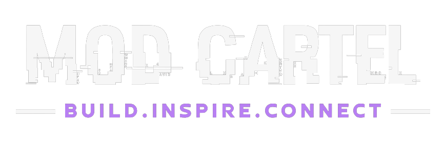
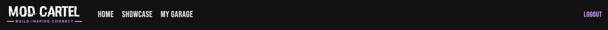
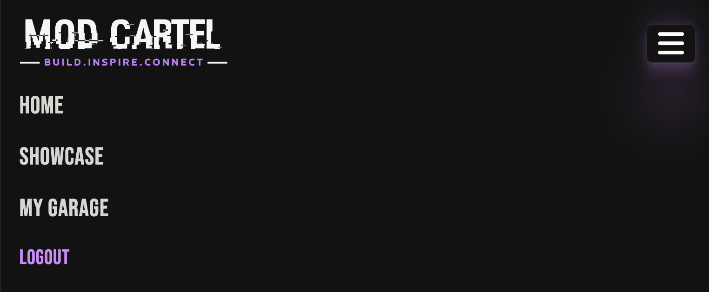
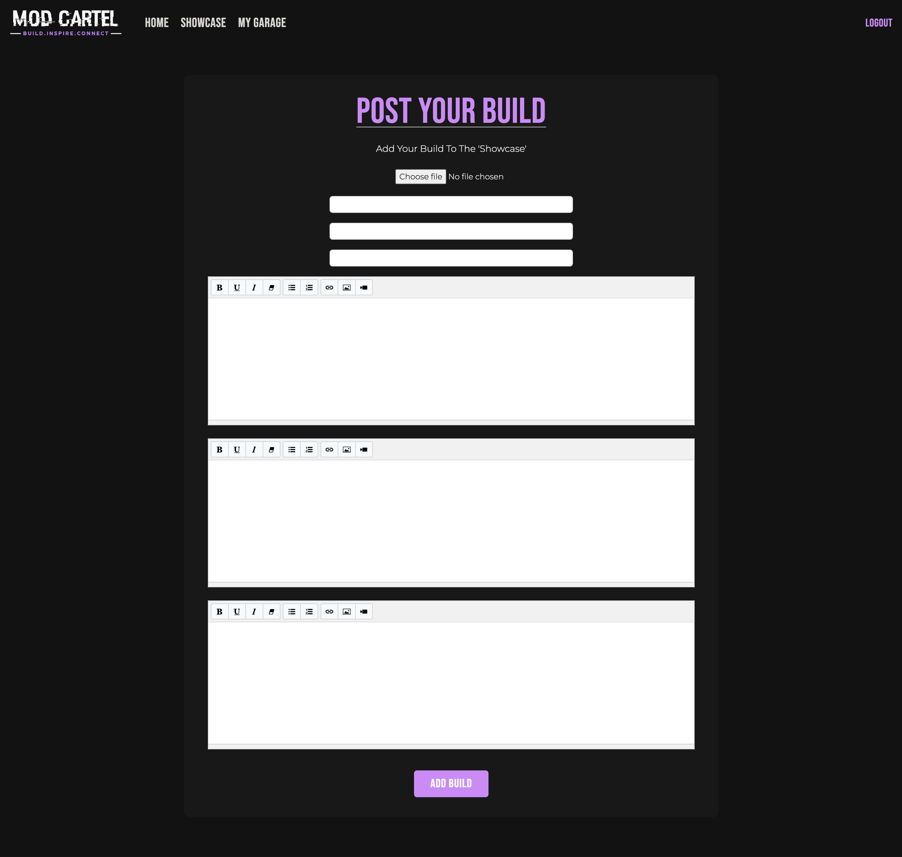
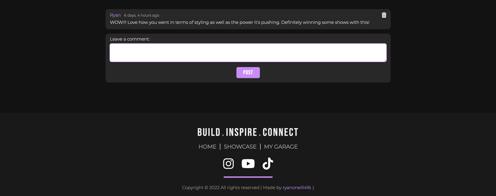

<h2>The car meet-up that never sleeps! Join the community and connect with like-minded individuals globally ;)</h2> 

<h1 id="contents">Table of Contents</h1>

- [Intro](#intro)
 - [User Experience - UX](#user-experience)
   - [User Stories](#user-stories)
   - [Agile Methodology](#agile-methodology)
   - [The Scope](#the-scope)
- [Design](#design)
   - [Colours](#colours)
   - [Typography](#typography)
   - [Media](#media)
   - [Database Schema](#database-schema)
   - [Wireframes](#wireframes)
- [Features](#features)
   - [Home Page](#home-page)
   - [Desktop Navigation](#desktop-navigation)
   - [Mobile Navigation](#mobile-navigation)
   - [Add Build Functionality](#add-build)
   - [Build Details](#build-details)
   - [Build Comments Section](#build-comments-section)
   - [Saved Builds](#saved-builds)
   - [Trending Builds](#trending-builds)
   - [My Garage](#my-garage)
   - [Future Features](#future-features)
- [Technologies](#technologies)
   - [Languages](#languages)
   - [Django Packages](#django-packages)
   - [Frameworks & Libraries](#frameworks)
- [Development & Testing](#testing)
   - [Database](#database)
   - [Automated Testing](#testing)
   - [Code validation](#code-validation)
- [Deployment](#deployment)
- [Credits](#credits)

<h1 id="intro">Project Intro</h1>

This is my fourth portfolio project as part of my Full-Stack Software Development Diploma. Mod Cartel is a social app for car enthusiasts to connect with and inspire others with the cars they've built. The app allows users to post the cars they've built, as well as like, comment and save the builds that have been posted by other members of the community. Users have full CRUD functionality and can manage their cars in their dedicated 'My Garage' page.

<a href="https://mod-cartel.herokuapp.com/" target="_blank"><h2>Check it out for yourself here!</h2></a>  

<h1 id="user-experience">User Experience Design</h1>

<h2 id="user-stories">User Stories</h2>

* As an unauthenticated user, I can:

- Navigate around the application and efficiently view all application content in a pleasant manner.
- Use the call-to-action on the homepage or the navigation link to become a member.
- View all posted member builds in the 'Showcase' as well as the 'Trending Builds'.
- I can view the build details in full.
- I can view how many likes a build has gotten.
- I can view all comments made on a specific build.
- I can use the footer to join the community social media pages and the secondary navigation links.

* As an authenticated user, I can:

- Perform all of the same tasks that an unauthenticated user can.
- I can quickly post a new build by the call-to-action on the home page.
- I can like and unlike member builds.
- I can comment on posted builds.
- I can delete the comments I have made on a posted build.
- I can save and unsave member builds.
- I can view the save builds in the 'Showcase' in the 'Saved Builds' tab.
- I can utilise the 'My Garage Page'.
- I can edit existing builds to ensure they are up to date with reality.
- I can delete builds that I no longer want to showcase.

* As a superuser / staff member, I can:

- Perform all of the previously mentioned tasks above.
- I can delete any comments that have been made in the application itself.
- I can delete posted builds.
- I can edit posted builds.
- I can edit comments that have been posted.
- I can mark a build as featured so it will show in the 'Member Spotlight' section of the homepage.
- I can add a featured excerpt to a featured post if I wish for this to be displayed when the build is highlighted.

<h2 id="agile-methodology">Agile Methodology</h2>

Agile methodology was used in planning the development of Mod Cartel. This was done through a project kanban board embodying a prioritisation model which can be found <a href="https://github.com/users/ryanoneill416/projects/4/views/1">Mod Cartel User Stories</a>

Issues were used to create User Stories that were deemed one of the following: Needs to have, Should have, Could have. Each User Story had a clear title and action.

3 'Could Have' features were not implemented due to time constraints and the feautured not having an effect on the required assessment criteria. These were in relation to an additional 'Events' page where events would be posted and organised by staff. Each would allow commenting and registration up to a certain number of capacity.

<h2 id="the-scope">The Scope</h2>

- To provide users with a pleasant and efficient experience when using the Mod Cartel application.
- To provide users with a visually appealing domain which is intuitive and follows convention.
- To provide an application with a dedicated focus and target audience.
- To provide permissions for members to access additional functionality such as posting, commenting, liking and saving content.
- To provide an application where non authenticated users can still use it effictively in exploring what it has to offer, not being behind a mandatory sign-up roadblock.
- To provide a space for members to manage their own builds as well as save other builds they are inspired by for future easy visitation.

<a href="#top">Back to Table of Contents</a>

<h1 id="design">Design</h1>

<h2 id="colours">Colours</h2>

- I opted for a dark themed application utilizing a linear path of very dark to light grey background colours(#121212 - #181818 - #191919 - #282828).
- The chosen application accent color is a shade of lilac, this is used for various elements such as the main logos, various transition effects, horizontal rules and buttons etc. (#d383f8).
- Font color was pure white (#ffff), used in conjunction with varying opacities in order to differentiate importance of text.

<h2 id="typography">Typography</h2>

- The typography used was installed using Google Fonts.
- Headings are using the 'Bebas Neue' font.
- General bodies of text are using 'Montserrat'.
- 'Sans-serif' is being used as a fall-back option if Google Fonts fails to load in unforeseen circumstance.

<h2 id="media">Media</h2>

- All images used in the application are from both <a href="https://unsplash.com/">Unsplash</a> and <a href="https://www.pexels.com/">Pexels</a>.
- The Mod Cartel logos and branding are custom created by myself :)
- The database schema and wireframes were made using <a href="https://balsamiq.cloud/">Balsamiq</a>.

<h2 id="database-schema">Database Schema</h2>

<h2 id="wireframes">Wireframes</h2>

Home (Desktop):

Showcase (Desktop):

Home (Mobile):

Showcase (Mobile):

<a href="#top">Back to Table of Contents</a>

<h1 id="#features">Features</h1>

<h2 id="home-page">Home Page</h2>

- The landing page is the applications first impression on the user. It is designed to grab their attention, portray its purpose and be easily digestible.

<h2 id="desktop-navigation">Desktop Navigation</h2>

- The applications navigation is found at the top of the page, it has a tinted transparent background and sticks to the top of the user's screen for ease of navigation.
- It holds the links for 'Home', 'Showcase' and 'My Garage'(Only if user logged in).
- The far right contains a 'Sign Up' / 'Login' option if not logged in, and 'Logout' if logged in.

<h2 id="mobile-navigation">Mobile Navigation</h2>

- The applications mobile navigation sits within a burger menu, illuminating and animating to reveal the same navigation links.
- This is done to encompass design responsiveness principles.

<h2 id="add-build">Add Build Functionality</h2>

- The applications 'Add Build' functionality allows authenticated members to post their own builds to the database.
- Once the form is completed successfully, this build will be added to 'The Showcase'.
- It will also then appear in members own 'My Garage' page, where it can be edited and deleted.

<h2 id="add-build">Add Build Functionality</h2>

- The applications 'Add Build' functionality allows authenticated members to post their own builds to the database.
- Once the form is completed successfully, this build will be added to 'The Showcase'.
- It will also then appear in members own 'My Garage' page, where it can be edited and deleted.

<h2 id="build-details">Build Details Page</h2>

- The applications 'Build Detail' page provides an inside look into the user build beyond picture, make and model.
- It is the page where members can like, comment and save builds within the community.
- It details the following about each build 'Overview', 'Specifications' as well as 'Plans/Recommendations'.
- This insures future members can use this page as inspiration for their own and they can understand what was required of the build itself.
- it is on this page that members can post comments giving feedback or to ask questions etc.

