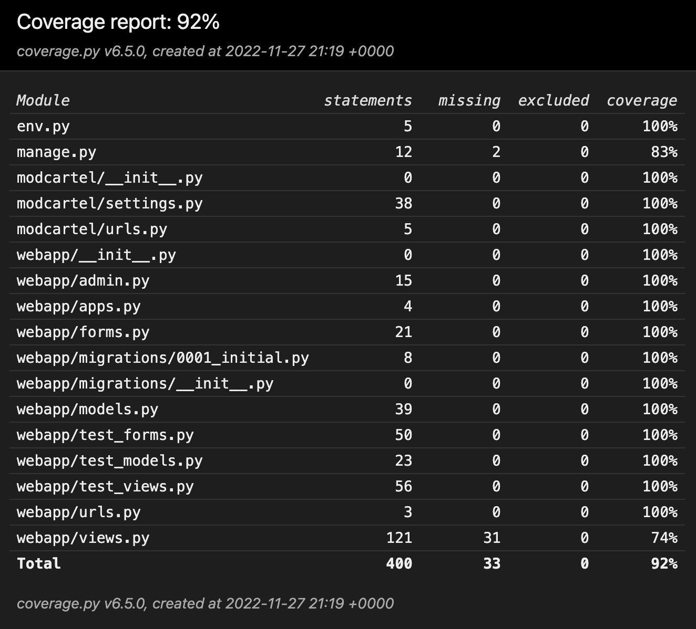

<h1 id="top">Mod Cartel Testing Documentation</h1>

Back to the [README](README.md)

<h1 id="contents">Contents</h1>

- [Automated Unit Testing Results](#automated-testing-results)
- [Frontend](#frontend)
- [Backend/Admin Panel](#backend)
- [Python Validation - PEP8](#python-validation)
- [Lighthouse](#lighthouse)
- [Console Results](#console-results)
- [Bugs / Issues](#bugs)

<h2 id="automated-testing-results">Automated Unit Testing Results</h2>

<h3>Automated testing coverage is at 92%</h3>

- This can be improved upon for sure and is something which I aim to come back to in future and tackle, however I am aware coverage over 90% is considered industry standard.
- You can locate all of the test files written <a href="https://github.com/ryanoneill416/mod_cartel/tree/main/webapp/tests">here</a>.

