<h1 id="top">Mod Cartel Testing Documentation</h1>

Back to the [README](README.md)

<h1 id="contents">Contents</h1>

- [Automated Unit Testing Results](#automated-testing-results)
- [HTML Validation](#html-validation)
- [CSS Validation](#css-validation)
- [Python Validation - PEP8](#python-validation)
- [Lighthouse](#lighthouse)
- [Console Results](#console-results)
- [Bugs / Issues](#bugs)

<h2 id="automated-testing-results">Automated Unit Testing Results</h2>

<h3>Automated testing coverage is at 92%</h3>

- This can be improved upon for sure and is something which I aim to come back to in future and tackle, however I am aware coverage over 90% is considered industry standard.
- You can locate all of the test files written <a href="https://github.com/ryanoneill416/mod_cartel/tree/main/webapp/tests">here</a>.

<h2 id="html-validation">HTML Validation</h2>

All html code passes validation with no errors, you can see each result below:

<h3>Index.html</h3>

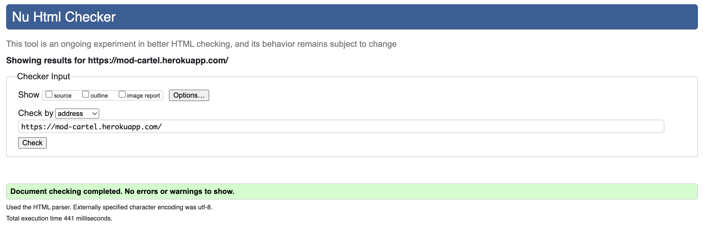

<h3>Showcase.html</h3>

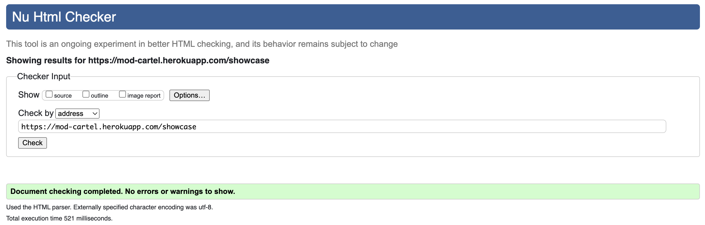

<h3>Build_detail.html</h3>

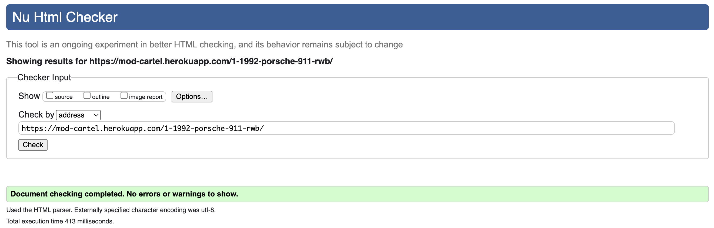

<h3>My-garage.html</h3>

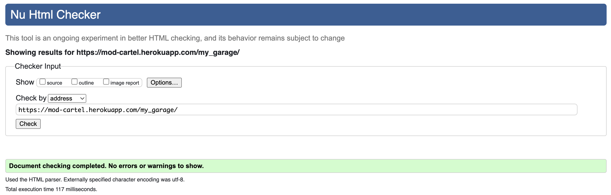

<h2 id="css-validation">CSS Validation</h2>

All CSS code passes validation with no errors, you can see each result below:

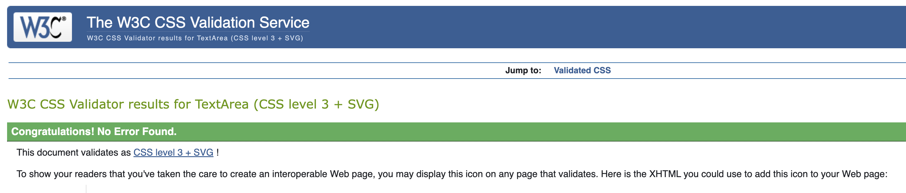

<h2 id="python-validation">Python Validation - PEP8</h2>

All python code passes pep8 validation with no errors, you can see each result below:

<h3>Admin.py</h3>

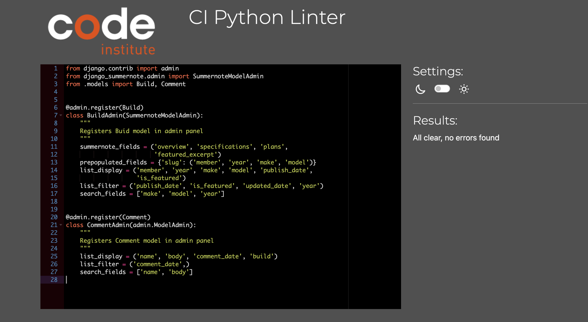

<h3>Apps.py</h3>

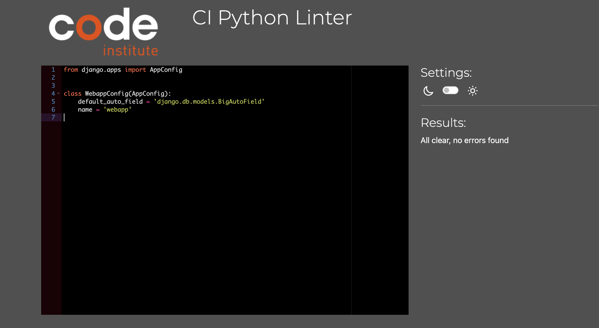

<h3>Forms.py</h3>

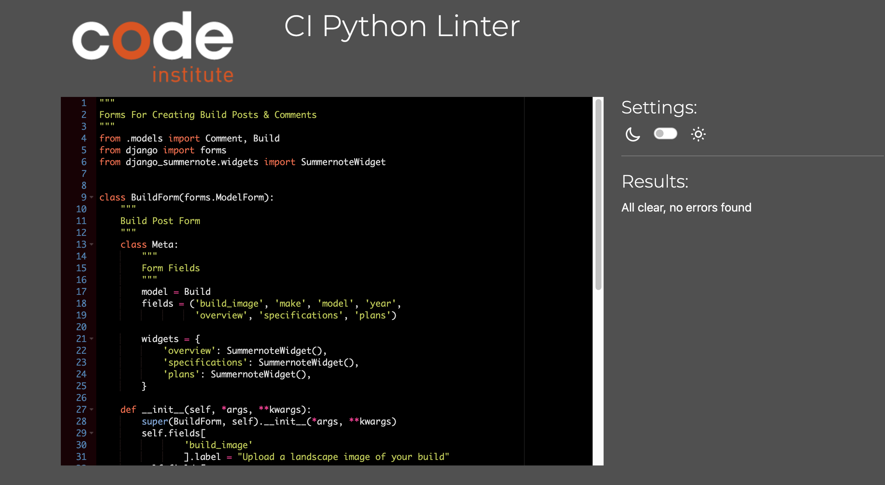

<h3>Models.py</h3>

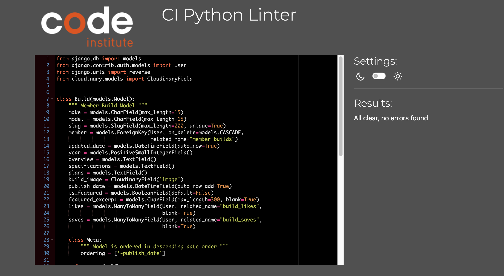

<h3>Urls.py</h3>

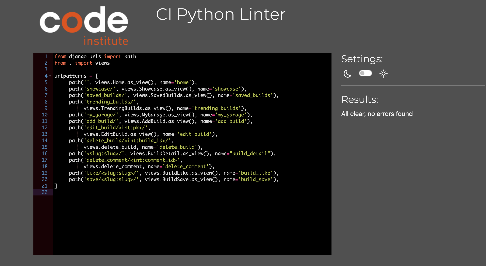

<h3>Views.py</h3>

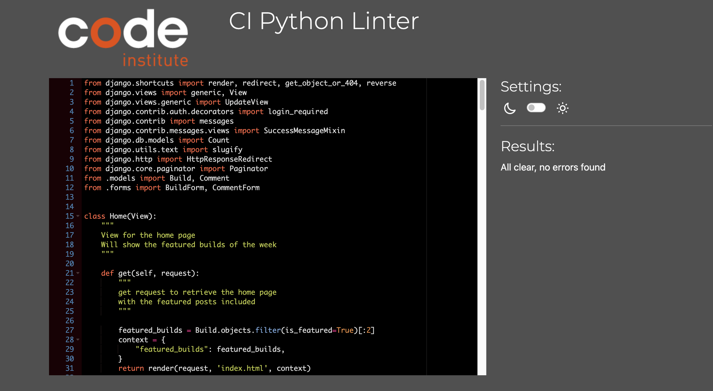

<h2 id="lighthouse">Lighthouse</h2>

- Lighthouse score can be improved upon and is at my highest priority when it comes to future updates/ implementations.
- The nature of the lower scores is a result of image resizing for the carousel and header images as the same image is adjusted for all screen size.
- The score is also negatively effected by file types uploaded by members.
- To remedy this in future, I already have plans to make a sole mobile version of this application to learn mobile development thoroughly, however I will adjust the image model to convert images automatically to webp.
- Due to time constraints and the need to do extra learning exploring these methodologies, the score is left with room to improve.

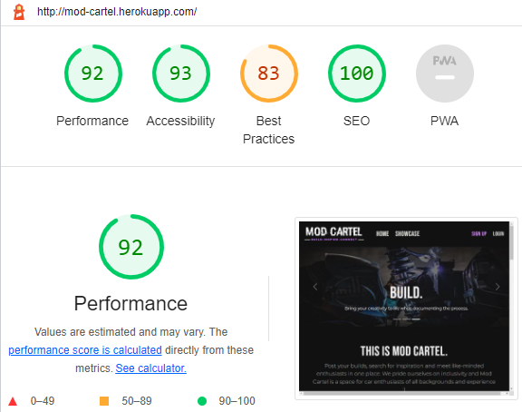
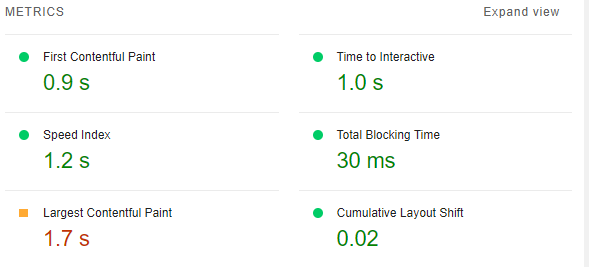

<h2 id="console-results">Console Results</h2>

<h3>There are no open errors evident in the console.</h3>

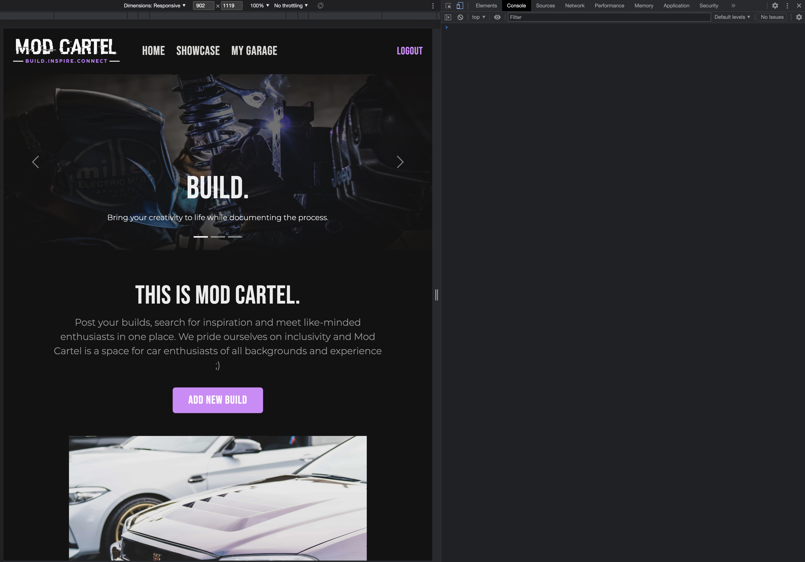

<h2 id="bugs">Bugs / Issues</h2>

<h3>Image Rendering</h3>

- It has made it to my attention that image rendering in the application is a bug that requires amending.
- The build_image field of the Build model will display the image in which the user uploads, however this is never guaranteed to be a minute and responsive .webp file so this has lead to large contentful paint being affected.
- This came to my attention late in the project cycle and so is of top priority as I continue to update and improve this application after completion of my studies.

<h3>Image Resizing</h3>

- Due to the implementation of a 100% width carousel and hero image on every page of the application, image resizing is utilised and this impacts the lighthouse scores as much as the previous known bug.
- To amend this I will be required to either rearrange the format of the applications stlying or use seperate images for differnet device width parameters.
- Another solution would be to build a dedicated mobile app for the application.
- As this was noted towards the later stage of development, this issue was not remedied and will be prioritised in further development of the application.